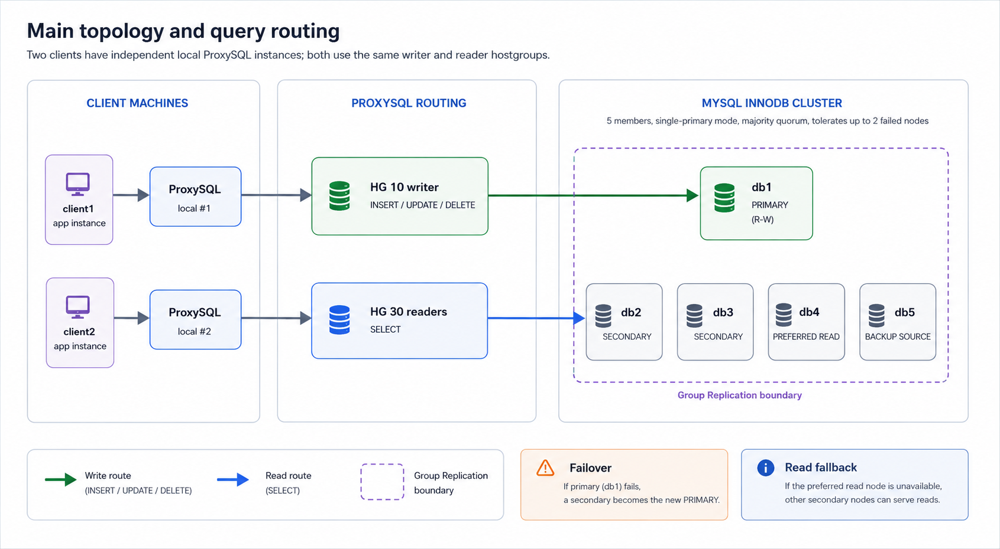
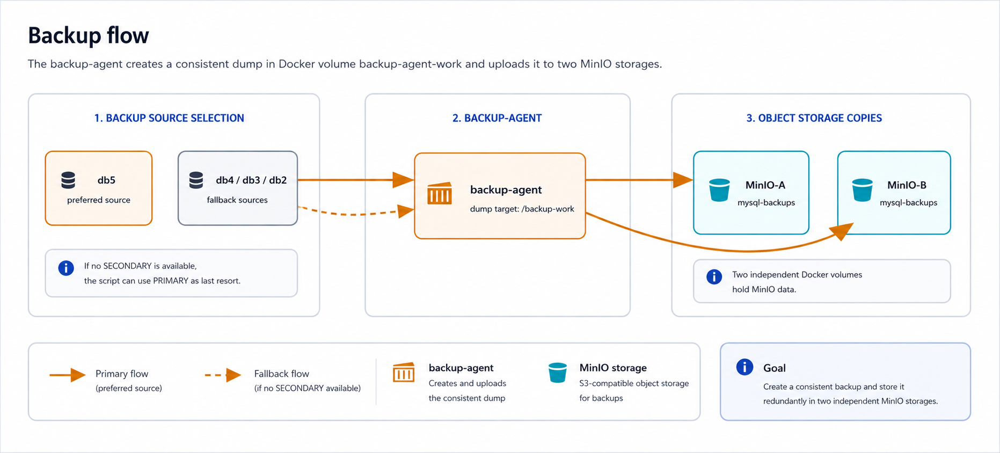
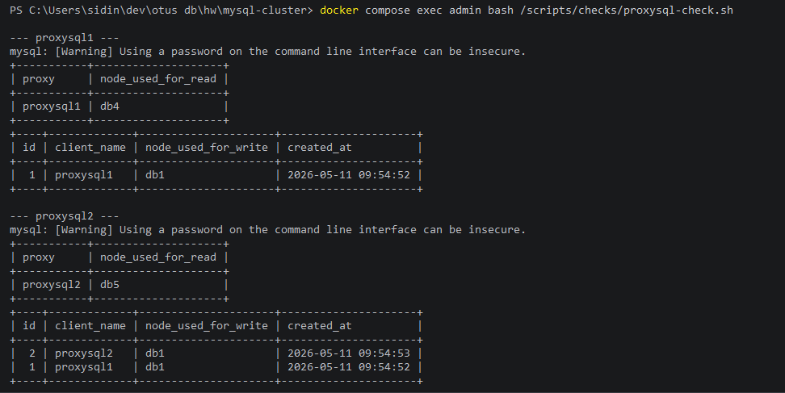
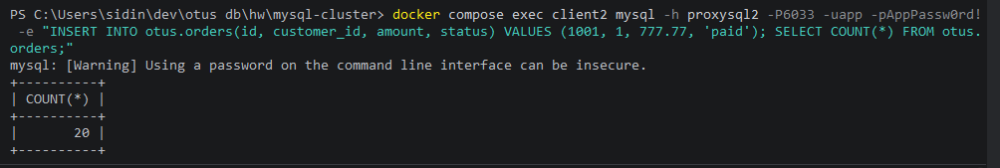

# MySQL InnoDB Cluster

В этой работе я разворачиваю отказоустойчивый кластер MySQL на Docker Compose. В основе кластера - MySQL InnoDB Cluster в режиме single-primary: одна нода принимает запись, остальные работают как read-only replicas и могут использоваться для чтения, failover и резервного копирования.

## Топология



На основной схеме показаны:

- зеленый маршрут - запись через локальный ProxySQL на текущую primary-ноду;
- синий маршрут - чтение через reader hostgroup ProxySQL;
- фиолетовая пунктирная рамка - область Group Replication между участниками кластера.



На схеме бэкапа показано, как `backup-agent` выбирает источник, создает dump во временном каталоге Docker volume и загружает его в два MinIO-хранилища.

Состав стенда:

| Сервис | Назначение |
|---|---|
| `db1` - `db5` | пять MySQL-нод InnoDB Cluster |
| `proxysql1` | локальный ProxySQL для `client1` |
| `proxysql2` | локальный ProxySQL для `client2` |
| `client1`, `client2` | имитация двух отдельных клиентских машин |
| `backup-agent` | отдельная машина для снятия и отправки бэкапов |
| `minio-a`, `minio-b` | два независимых S3-compatible хранилища для бэкапов |

Порты на хосте:

| Сервис | Порт |
|---|---:|
| `db1` | `3311` |
| `db2` | `3312` |
| `db3` | `3313` |
| `db4` | `3314` |
| `db5` | `3315` |
| `proxysql1` SQL | `16033` |
| `proxysql1` admin | `16032` |
| `proxysql2` SQL | `26033` |
| `proxysql2` admin | `26032` |
| `minio-a` API | `9001` |
| `minio-a` console | `19001` |
| `minio-b` API | `9002` |
| `minio-b` console | `19002` |

MinIO consoles:

- `http://localhost:19001`
- `http://localhost:19002`

Логин и пароль для MinIO: `minioadmin` / `minioadmin123`.

## Конфигурация проекта

Конфигурация MySQL вынесена из `docker-compose.yml` в обычные файлы:

| Файл | Назначение |
|---|---|
| `config/mysql/conf.d/common.cnf` | общие настройки GTID и Group Replication через XCOM |
| `config/mysql/conf.d/db1.cnf` - `config/mysql/conf.d/db5.cnf` | уникальные параметры каждой ноды: `server-id`, `report-host`, `group-replication-local-address` |
| `config/proxysql/proxysql.cnf` | базовая конфигурация ProxySQL |

MySQL-конфиги копируются в локальный Docker-образ через `config/mysql/Dockerfile`. Так MySQL не игнорирует конфиги из-за прав доступа bind mount на Windows.

`backup-agent` собирается через `backup-agent/Dockerfile`: в образ добавлен MinIO Client `mc`, чтобы агент мог отправлять dump сразу в оба MinIO.

Рабочий dump создается в Docker volume `backup-agent-work`, после загрузки в MinIO временный каталог внутри volume удаляется. В проектной папке бэкапы и временные данные не создаются.

Скрипты разложены по назначению:

| Папка | Назначение |
|---|---|
| `scripts/cluster` | создание кластера и возврат ноды в кластер |
| `scripts/proxysql` | настройка ProxySQL |
| `scripts/data` | загрузка тестовой базы |
| `scripts/checks` | проверки статуса, данных и маршрутизации |
| `scripts/backup` | снятие consistent dump и отправка в MinIO |
| `scripts/common` | общие переменные окружения |

## Почему single-primary

Я выбираю single-primary, потому что для учебного стенда и большинства OLTP-сценариев это самый понятный вариант с хорошей консистентностью:

- все записи идут в одну primary-ноду;
- secondary-ноды доступны для чтения;
- при отказе primary кластер выбирает новую primary;
- ProxySQL обновляет маршрутизацию writer/reader hostgroup;
- риск конфликтов записи ниже, чем в multi-primary.

Multi-primary здесь не нужен: он сложнее в эксплуатации, требует внимательнее проектировать ключи и конфликты записи, а для задания важнее показать надежный failover и прозрачную маршрутизацию запросов.

## Консистентность

Внутри кластера используется Group Replication. Это не классическая асинхронная репликация master-replica: транзакции проходят через согласование группы, а кластер сохраняет единое представление состава участников.

Для стенда я оставляю дефолтную гарантию `BEFORE_ON_PRIMARY_FAILOVER`: после выбора новой primary она не начинает принимать новые операции, пока не применит backlog от старой primary. Это защищает от чтения старого состояния после failover.

Для обычных запросов чтение идет через read hostgroup ProxySQL. Для операций, где нельзя получить устаревшее чтение после записи, запрос можно выполнять на writer или выставлять в сессии:

```sql
SET SESSION group_replication_consistency = 'BEFORE';
```

Глобально `BEFORE_AND_AFTER` я не включаю, потому что это даст самые строгие гарантии, но заметно увеличит задержки. Для этой работы важнее показать баланс: записи консистентны внутри группы, чтения масштабируются через secondary, а критичные чтения можно усилить на уровне сессии.

## Отказоустойчивость

В кластере 5 MySQL-нод. Для Group Replication важен кворум большинства:

- при 3 нодах кластер переживает отказ 1 ноды;
- при 5 нодах кластер переживает отказ 2 нод;
- 4 ноды не дают такого же аккуратного выигрыша, потому что majority все равно требует 3 участника.

ProxySQL установлен на каждой клиентской машине отдельно. Поэтому ProxySQL не является общей единой точкой отказа: отказ `proxysql1` влияет на `client1`, но `client2` продолжает работать через `proxysql2`.

`db4` выделена как preferred read-нода за счет большего веса в ProxySQL. Остальные secondary остаются fallback-нодами для чтения. `db5` выделена как preferred backup source; если она недоступна, `backup-agent` выбирает другую живую secondary.

Backup сохраняется в два независимых MinIO-хранилища. Если одно хранилище будет недоступно, второе остается отдельной копией данных. В рамках стенда оба MinIO работают в Docker volume, а не в папке проекта.

## В каких случаях помогает

Эта схема помогает, если:

- отказала одна или две MySQL-ноды;
- отказала текущая primary-нода;
- один клиент потерял свой локальный ProxySQL;
- preferred read-нода недоступна, но есть другие secondary;
- preferred backup-нода недоступна, но есть другая online-нода;
- один экземпляр MinIO недоступен, но второй сохранил копию бэкапа;
- нужно развести запись и чтение без изменения приложения.

## Ограничения

Эта схема не спасает от всех аварий:

- если потерян кворум MySQL-нод, кластер остановит запись;
- если все ноды находятся на одном физическом хосте, остается риск отказа этого хоста;
- если приложение требует строгое read-after-write с любой read-ноды, это нужно явно учитывать через writer route или session consistency;
- ProxySQL на клиенте не спасает конкретный клиент, если умер сам хост клиента;
- два MinIO-контейнера на одном Docker-хосте не заменяют полноценное удаленное объектное хранилище;
- логический dump не заменяет полноценную политику disaster recovery с регулярной проверкой восстановления.

## Запуск

Полный сброс стенда:

```bash
docker compose down -v
```

Запуск контейнеров:

```bash
docker compose up -d --build
```

Создание или обновление InnoDB Cluster:

```bash
docker compose exec admin bash /scripts/cluster/init-cluster.sh
```

Настройка двух ProxySQL:

```bash
docker compose exec admin bash /scripts/proxysql/configure-proxysql.sh
```

Загрузка тестовых данных через `proxysql1`:

```bash
docker compose exec admin bash /scripts/data/load-data.sh
```

## Проверка кластера

Статус InnoDB Cluster и состояние Group Replication на каждой ноде:

```bash
docker compose exec admin bash /scripts/checks/status.sh
```

Полный вывод команды: [snapshots/01-cluster-status.txt](snapshots/01-cluster-status.txt)

Проверка таблиц и количества строк на каждой ноде:

```bash
docker compose exec admin bash /scripts/checks/query-each-node.sh
```

Полный вывод команды: [snapshots/02-data-on-each-node.txt](snapshots/02-data-on-each-node.txt)

Проверка, что оба клиента работают через свой ProxySQL:

```bash
docker compose exec admin bash /scripts/checks/proxysql-check.sh
```



Прямое подключение с первой клиентской машины:

```bash
docker compose exec client1 mysql -h proxysql1 -P6033 -uapp -pAppPassw0rd! -e "SELECT @@hostname; SELECT COUNT(*) FROM otus.orders;"
```

Прямое подключение со второй клиентской машины:

```bash
docker compose exec client2 mysql -h proxysql2 -P6033 -uapp -pAppPassw0rd! -e "SELECT @@hostname; SELECT COUNT(*) FROM otus.orders;"
```

## Демонстрация отказа primary

В свежем стенде primary обычно `db1`. Сначала проверяю статус:

```bash
docker compose exec admin bash /scripts/checks/status.sh
```

Останавливаю primary:

```bash
docker compose stop db1
```

Проверяю, что кластер выбрал новую primary:

```bash
docker compose exec admin bash /scripts/checks/status.sh
```

Полный вывод команды: [snapshots/04-primary-failover-status.txt](snapshots/04-primary-failover-status.txt)

Проверяю запись через второй клиент и его локальный ProxySQL:

```bash
docker compose exec client2 mysql -h proxysql2 -P6033 -uapp -pAppPassw0rd! -e "INSERT INTO otus.orders(id, customer_id, amount, status) VALUES (1001, 1, 777.77, 'paid'); SELECT COUNT(*) FROM otus.orders;"
```



Возвращаю ноду. В штатном случае она подключается к кластеру автоматически, потому что в конфиге включено `group-replication-start-on-boot=ON`:

```bash
docker compose start db1
```

Проверяю, что нода снова `ONLINE`:

```bash
docker compose exec admin bash /scripts/checks/status.sh
```

`rejoin-node.sh` нужен только как аварийная команда, если нода не вернулась в кластер автоматически:

```bash
docker compose exec admin bash /scripts/cluster/rejoin-node.sh db1
```

## Бэкап

Бэкап снимается отдельным `backup-agent`. Он сначала пытается использовать `db5`, затем `db4`, `db3`, `db2`, и только если нет secondary - primary.

Создать бэкап:

```bash
docker compose exec backup-agent bash /scripts/backup/backup.sh
```

Проверить, что dump есть в обоих MinIO:

```bash
docker compose exec backup-agent mc ls --recursive minio-a/mysql-backups
docker compose exec backup-agent mc ls --recursive minio-b/mysql-backups
```

Проверка отказоустойчивости backup source:

```bash
docker compose stop db5
docker compose exec backup-agent bash /scripts/backup/backup.sh
docker compose start db5
```

Полный вывод команды: [snapshots/06-backup-fallback.txt](snapshots/06-backup-fallback.txt)

В выводе команды видно, с какой ноды снят бэкап и в какие MinIO-хранилища он загружен. Если `db5` недоступна, агент выбирает следующую живую secondary. 
В данном случае, агент выбрал db4.

## Основные учетные записи

| Пользователь | Пароль | Назначение |
|---|---|---|
| `root` | `RootPassw0rd!` | администрирование MySQL |
| `app` | `AppPassw0rd!` | запросы приложения через ProxySQL |
| `monitor` | `MonitorPassw0rd!` | мониторинг Group Replication из ProxySQL |
| `backup` | `BackupPassw0rd!` | consistent dump из `backup-agent` |
| `radmin` | `radmin` | администрирование ProxySQL |
| `minioadmin` | `minioadmin123` | доступ в MinIO |

## Очистка

Остановить контейнеры без удаления данных:

```bash
docker compose stop
```

Удалить контейнеры и все volume с данными:

```bash
docker compose down -v
```
